# Documentación del Proyecto

## Índice
- [Propósito del Proyecto](#propósito-del-proyecto)
- [Funcionalidades](#funcionalidades)
- [Modelo de dominio](#modelo-de-dominio)
- [Arquitectura y patrones](#arquitectura-y-patrones)
- [Practicas de codificación limpia aplicadas](#prácticas-de-codificación-limpia-aplicadas)
- [Estilos de programación aplicados](#estilos-de-programación-aplicados)
- [Principios SOLID aplicados](#principios-solid-aplicados)
- [Conceptos DDD aplicados](#conceptos-ddd-aplicados)

---
# Sistema de elecciones en linea
## Propósito del proyecto
El propósito de este proyecto es desarrollar un sistema de elecciones en línea que permita la gestión completa de un proceso electoral. Este sistema ofrece una plataforma segura y eficiente para registrar candidatos, electores y administrar la votación.

## Funcionalidades
#### 1. Diagramas de caso de uso

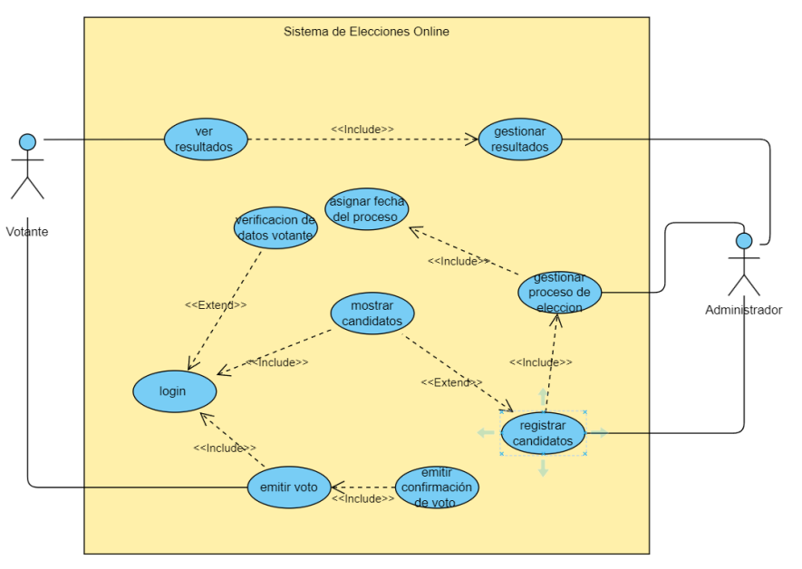

#### 2. Funcionalidades de Alto Nivel:
- Registro de Votantes: Permite a los usuarios registrarse en el sistema para poder votar.
- Gestión de Candidatos: Funcionalidad para registrar y gestionar candidatos en las elecciones.
- Votación en Línea: Los votantes pueden emitir su voto de forma segura.
- Resultados Electorales: Visualización de resultados en tiempo real una vez concluido el proceso de votación.
#### 3. Prototipo (o GUI):

##### Login:
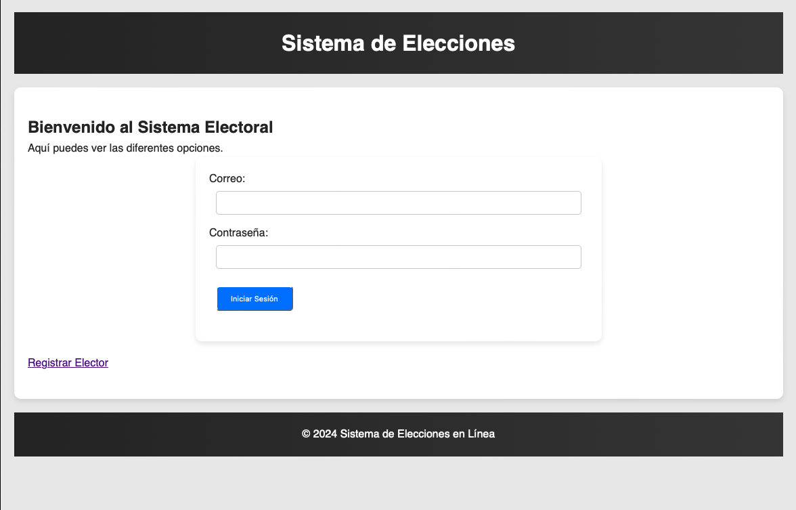
##### Menu:
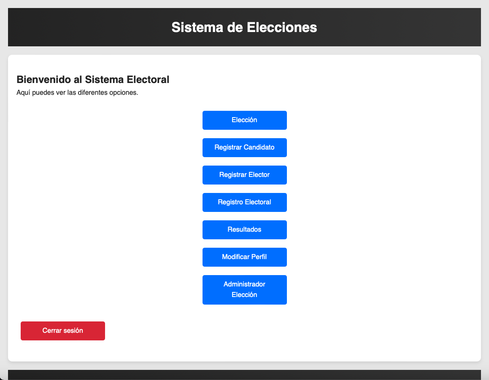
##### Registro de Elector:
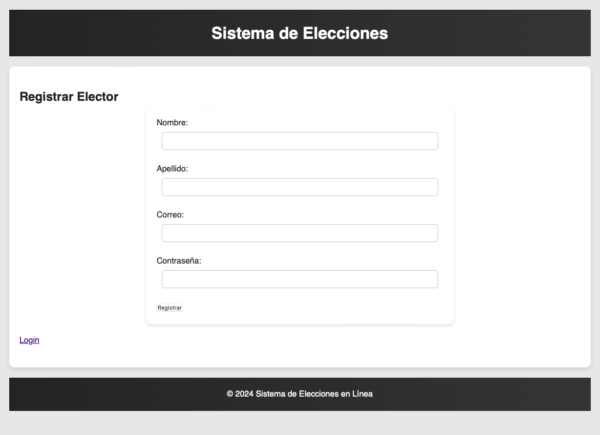
##### Registro de Candidato:
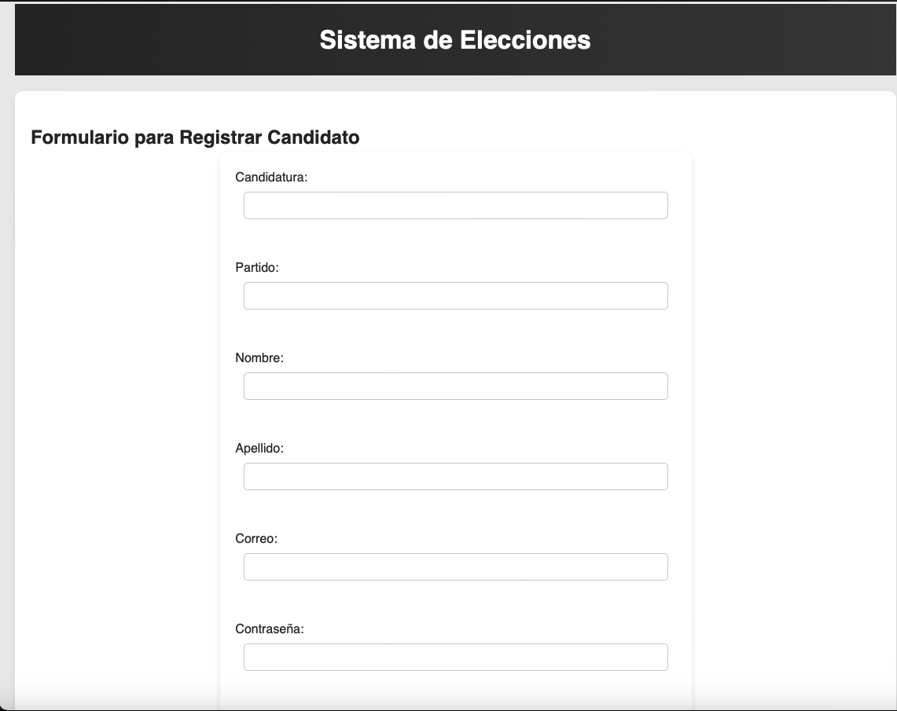
##### Registro de Elecciones:
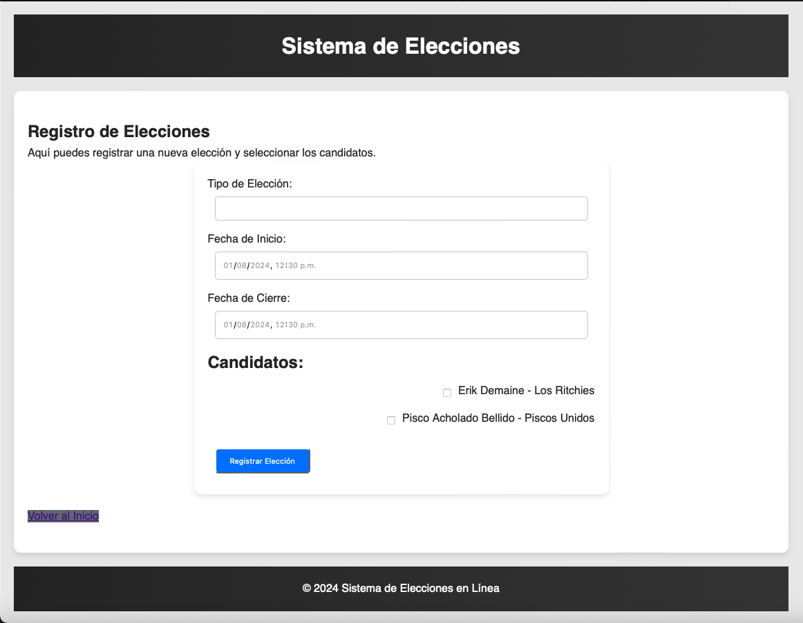


## Modelo de dominio
### 1. Diagrama de clases y modulos

#### Diagrama de clases:
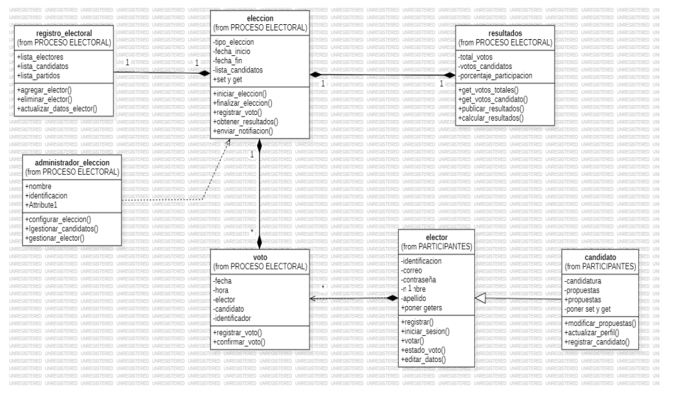
#### Diagrama de componentes:
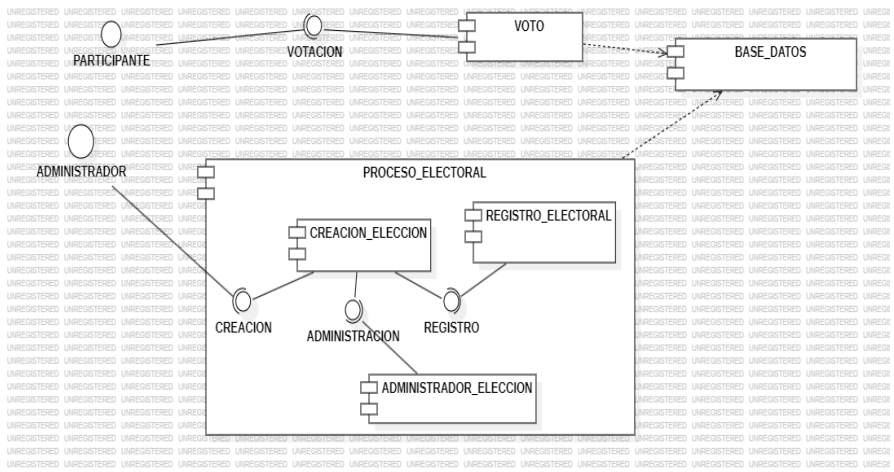
#### Diagrama de despligue:
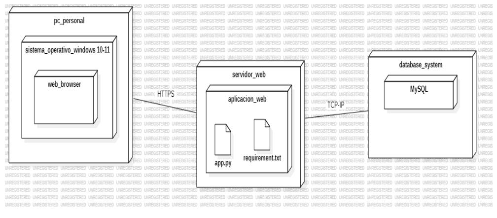
#### Diagrama de paquetes:
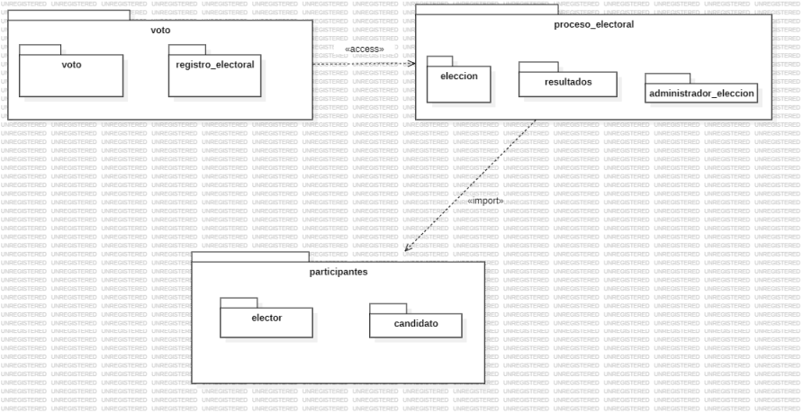

### 2. Módulos del Sistema
1. Módulo de Presentación
    - Maneja la interacción con el usuario.
    - Incluye vistas HTML y controladores para procesar las solicitudes.
  
2. Módulo de Proceso Electoral
    - Contiene la lógica para gestionar elecciones, incluyendo creación y conteo de votos.
    - Se ocupa de la ejecución del proceso electoral completo.
  
3. Módulo de Participantes
    - Gestiona la información sobre candidatos y electores.
    - Incluye operaciones CRUD y lógica de negocio relacionada con los participantes.
  
4. Módulo de Voto
    - Responsable de la creación, validación y almacenamiento de votos.
    - Implementa lógica para garantizar la integridad del proceso de votación.
  
5. Módulo de Resultados
    - Calcula y presenta los resultados de las elecciones.
    - Proporciona análisis y estadísticas sobre las elecciones.
  
6. Módulo de Registro Electoral
    - Gestiona el registro de electores y la validación de los derechos de voto.
    - Asegura que solo los usuarios autorizados puedan participar en las elecciones.

## Arquitectura y patrones
### 1. Arquitectura
#### Vista general de la arquitectura:
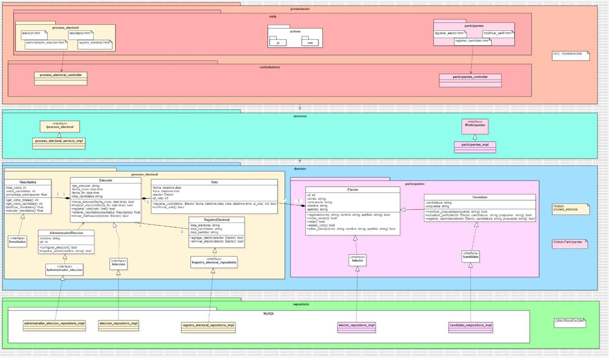

El proyecto sigue una arquitectura basada en capas, con una clara separación entre la lógica de negocio, la presentación y el acceso a datos:
- Capa de Presentación: Utiliza Flask para manejar las rutas y vistas. Los controladores gestionan las solicitudes HTTP y renderizan las plantillas HTML para la interacción con el usuario.
- Capa de Aplicación/Lógica de Negocio: Esta capa gestiona las reglas del negocio y coordina las interacciones entre la presentación y el acceso a datos. Aquí se incluyen las funciones y servicios que implementan la lógica del proceso electoral.
- Capa de Datos: Utiliza SQLAlchemy como ORM para gestionar la persistencia de datos en la base de datos, proporcionando una abstracción para el acceso a datos.

## Practicas de codificación limpia aplicadas
### Nombres de variables, funciones y clases
El proyecto hace uso de prácticas de codificación legible para variables, funciones y métodos según el estándar del lenguaje Python, que indica que se debe usar el *snake_case*. Del mismo modo, las clases siguen la convención *CamelCase*.

## Estilos de programación aplicados
### Modelo-Vista-Controlador (MVC): El proyecto sigue el patrón MVC, donde los modelos representan la estructura de datos, las vistas son las interfaces de usuario y los controladores manejan la interacción entre modelos y vistas.
- Repositorio: Se utiliza para la abstracción del acceso a datos, permitiendo a la capa de lógica de negocio interactuar con la base de datos a través de una interfaz coherente.

### Error/Exception Handling (constructive)
Este estilo se aplica en todos los métodos del repositorio para manejar posibles errores durante las operaciones con la base de datos. Si ocurre una excepción, la operación se revierte para mantener la integridad de los datos. 

### Cookbook
Con la integración de este estilo, se ve la implementación clara y directa de operaciones CRUD en los métodos del repositorio.

Constructive error/exception handling y Cookbook se ven en:

*candidato_repositorio_impl.py:*
```python
class candidato_respositorio_impl:
    def agregar_candidato(self, candidato): # Create
        try:
            db.session.add(candidato)
            db.session.commit()
            return True
        except Exception:
            db.session.rollback()
            return False

    def eliminar_candidato(self, candidato): # Delete
        try:
            db.session.delete(candidato)
            db.session.commit()
            return True
        except Exception:
            db.session.rollback()
            return False

    def obtener_candidato_por_id(self, id): # Read
        try:
            candidato = Candidato.query.get(id)
            return candidato
        except Exception:
            return None

    def actualizar_candidato(self, id, nueva_candidatura, nueva_propuesta): # Update
        try:
            candidato = Candidato.query.get(id)
            if candidato:
                candidato.candidatura = nueva_candidatura
                candidato.propuesta = nueva_propuesta
                db.session.commit()
                return True
            return False
        except Exception:
            db.session.rollback()
            return False
```

*elector_repositorio_impl.py:*
```python
class elector_repositorio_impl:
    def agregar_elector(self, elector):
        try:
            db.session.add(elector)
            db.session.commit()
            return True
        except Exception:
            db.session.rollback()
            return False

    def eliminar_elector(self, elector):
        try:
            db.session.delete(elector)
            db.session.commit()
            return True
        except Exception:
            db.session.rollback()
            return False

    def obtener_elector_por_id(self, id):
        try:
            elector = Elector.query.get(id)
            return elector
        except Exception:
            return None
    
    def actualizar_elector(self, id, nuevo_correo, nueva_contrasena, nuevo_nombre, nuevo_apellido, nuevo_estado_voto):
        try:
            elector = Elector.query.get(id)
            if elector:
                elector.correo = nuevo_correo
                elector.contrasena = nueva_contrasena
                elector.nombre = nuevo_nombre
                elector.apellido = nuevo_apellido
                elector.estado_voto = nuevo_estado_voto
                db.session.commit()
                return True
            return False
        except Exception:
            db.session.rollback()
            return False
```

### Persistent-Tables

Este estilo se aplica al definir los modelos de base de datos Candidato y Elector utilizando SQLAlchemy, lo que asegura que los datos se almacenan de manera óptima en la base de datos. 
Estas tablas se pueden ver en:

*En models/Candidato.py:*
```python
from Model.extensions import db

class Candidato(db.Model):
    id = db.Column(db.Integer, primary_key=True)
    candidatura = db.Column(db.String(100), unique=True, nullable=False)
    propuesta = db.Column(db.String(200), nullable=False)

    def __repr__(self):
        return f'<Candidato {self.candidatura}>'
```

*En models/Elector.py:*
```python
from Model.extensions import db

class Elector(db.Model):
    id = db.Column(db.Integer, primary_key=True)
    correo = db.Column(db.String(120), unique=True, nullable=False)
    contrasena = db.Column(db.String(120), nullable=False)
    nombre = db.Column(db.String(80), nullable=False)
    apellido = db.Column(db.String(80), nullable=False)
    estado_voto = db.Column(db.Boolean, default=False)
    
    def __repr__(self):
        return f'<Elector {self.nombre} {self.apellido}>'
```

## Principios SOLID aplicados
### 1. Principio de Responsabilidad Única (SRP)
El ParticipantesController tiene una única responsabilidad: manejar las solicitudes relacionadas con los participantes. No mezcla lógica de negocio ni de acceso a datos.

**Ejemplo:**
```python
class ParticipantesController:
    def __init__(self):
        self.servicio = ParticipantesServicio()

    @participantes_bp.route('/participantes', methods=['GET'])
    def obtener_participantes(self):
        participantes = self.servicio.obtener_todos()
        return jsonify(participantes)

    @participantes_bp.route('/participantes', methods=['POST'])
    def crear_participante(self):
        data = request.json
        nuevo_participante = self.servicio.crear(data)
        return jsonify(nuevo_participante), 201

    @participantes_bp.route('/participantes/<int:id>', methods=['PUT'])
    def actualizar_participante(self, id):
        data = request.json
        participante_actualizado = self.servicio.actualizar(id, data)
        return jsonify(participante_actualizado)

    @participantes_bp.route('/participantes/<int:id>', methods=['DELETE'])
    def eliminar_participante(self, id):
        self.servicio.eliminar(id)
        return '', 204
```

Asimismo, la clase AdministradorEleccion se encarga únicamente de registrar a un administrador, cumpliendo con el principio.

```python
class AdministradorEleccion:
    def __init__(self):
        self.nombre = None
        self.id = None
        self.password = None

    def registrar_admin(self, nombre: str, password: str, id: int) -> None:
        self.nombre = nombre
        self.password = password
        self.id = id
```

### 3. Principio de Abierto/Cerrado (OCP)
El ParticipantesController está abierto para la extensión (puedes añadir nuevos endpoints) pero cerrado para la modificación (no necesitas modificar el código existente para añadir nuevas funcionalidades).

**Ejemplo:**
```python
class ParticipantesController:
    # Métodos existentes...

    @participantes_bp.route('/participantes/<int:id>/detalle', methods=['GET'])
    def obtener_detalle_participante(self, id):
        detalle = self.servicio.obtener_detalle(id)
        return jsonify(detalle)
```

El ProcesoElectoralController está abierto para la extensión pero cerrado para la modificación.

**Ejemplo:**
```python
class ProcesoElectoralController:
    # Métodos existentes...

    @proceso_electoral_bp.route('/procesos-electorales/<int:id>/detalle', methods=['GET'])
    def obtener_detalle_proceso(self, id):
        detalle = self.servicio.obtener_detalle(id)
        return jsonify(detalle)
```

### 3. Principio de Segregación de Interfaces (ISP):
La interfaz IResultados está diseñada para proporcionar métodos específicos relacionados con la gestión de resultados, cumpliendo con el principio de Segregación de Interfaces (ISP) al asegurar que las implementaciones solo dependan de métodos que realmente utilizan `from abc import ABC`, que son `@abstractmethod`.

```python
class IResultados(ABC):
    @abstractmethod
    def agregar_voto(self, candidato: str) -> None:
        pass

    @abstractmethod
    def calcular_porcentajes(self) -> None:
        pass

    @abstractmethod
    def mostrar_resultados(self) -> dict:
        pass
```

### 2. Principio de Inversión de Dependencias (DIP)
El controlador depende de una abstracción (ParticipantesServicio) en lugar de una implementación concreta. Esto permite cambiar la implementación del servicio sin modificar el controlador.

**Ejemplo:**
```python
class ParticipantesController:
    def __init__(self, servicio):
        self.servicio = servicio

# Uso
servicio = ParticipantesServicio()
controller = ParticipantesController(servicio)
```

El controlador depende de una abstracción (ProcesoElectoralServicio) en lugar de una implementación concreta.

**Ejemplo:**
```python
class ProcesoElectoralController:
    def __init__(self, servicio):
        self.servicio = servicio

# Uso
servicio = ProcesoElectoralServicio()
controller = ProcesoElectoralController(servicio)
```
